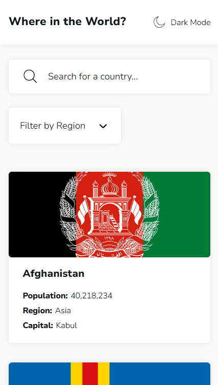
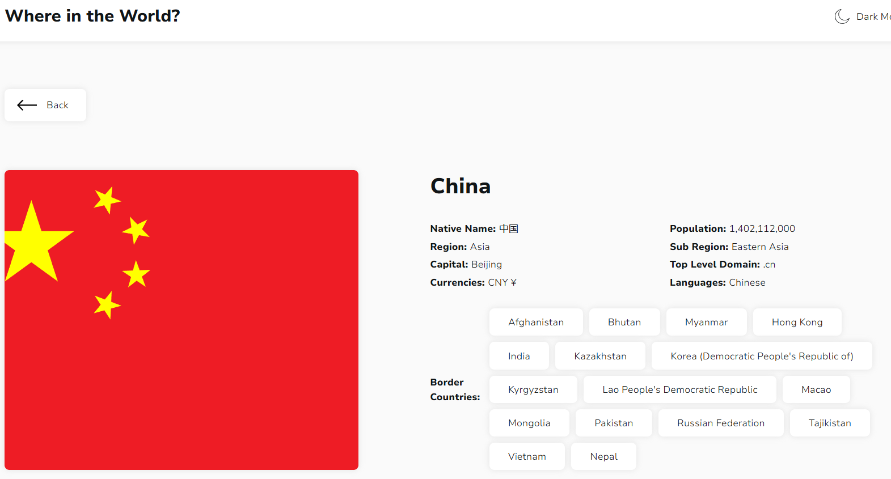
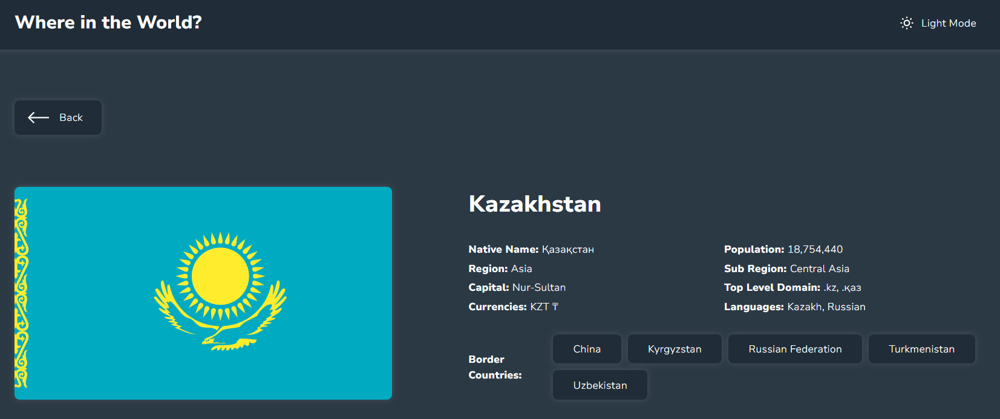

# Описание проекта
`Rest-Countries` — это веб-приложение на чистом `HTML`, `CSS` и `JavaScript`, которое:

- Загружает и отображает список всех стран мира.

- Позволяет выполнять поиск и фильтрацию стран по разным параметрам (например, по имени, региону, столице).

- Генерирует отдельную страницу деталей для каждой страны.

- Хранит данные в `localStorage` для более быстрой загрузки при последующих визитах.

## Скриншоты проекта:
### Главная страница:




### Страница деталей страны:






### Основные функции
- 🔎 Поиск стран по введённым данным.

- 🗺️ Фильтрация списка по региону и другим характеристикам.

- 📄 Динамическая генерация карточек стран с флагом, населением, регионом и столицей.

- 📥 Сохранение загруженных данных в localStorage для оптимизации производительности.

- 📄 Детальная страница страны по клику на карточку.

## Запуск проекта: 
- Открыть в любой IDE и запустить локальный сервер.
- Либо открыть по ссылке: https://dumkaguv.github.io/Rest-Countries/

### Примеры использования проекта с приложением скриншотов или фрагментов кода:

#### 1. Класс `Countries` отвечает за:

- Получение данных о странах из локального файла `data.json`.

- Сохранение данных в `localStorage`.

- Фильтрацию стран на основе параметров поиска.

- Рендеринг `HTML-карточек` для стран.

- Создание динамических ссылок на страницу деталей.

#### Инициализация:
```javascript
async init() {
  this.data = await this.getData();

  if (!this.isDataInitialized) {
    this.isDataInitialized = true;
  }

  this.saveData(this.data);
  this.renderCountries();
}
```
Метод `init` инициализирует данные, сохраняет их и вызывает рендеринг списка стран.

#### Загрузка данных о странах:
```javascript
async getData() {
  try {
    const response = await fetch("./data.json");

    if (response.status === 404) {
      console.error("Ошибка при загрузке данных 404");
      return [];
    }

    const data = await response.json();

    return data;
  } catch (error) {
    console.error("Ошибка при загрузке данных:", error);

    return [];
  }
}
```
#### Что здесь происходит:
- Данные загружаются с файла `data.json`.

- Если сервер возвращает ошибку 404 — в консоль выводится сообщение и возвращается пустой массив.

- В случае других ошибок (`catch`) также возвращается пустой массив.

#### Фильтрация данных:
```js
filterData = (searchParams = {}) => {
  const filteredData = this.data.filter((item) => {
    if (Object.values(searchParams).every((value) => !value)) {
      return true;
    }

    return Object.entries(searchParams).every(([key, value]) => {
      if (!value) return true;

      return item[key]
        ?.toString()
        .trim()
        .toLowerCase()
        .startsWith(value.trim().toLowerCase());
    });
  });

  return filteredData || [];
};
```

#### Что здесь происходит:
- Метод `filterData` принимает объект с параметрами поиска (`searchParams`).

- Если все значения поиска пустые — возвращаются все страны.

- Иначе, для каждого параметра поиска проверяется, начинается ли значение поля страны с указанного текста.

- Фильтрация нечувствительна к регистру и лишним пробелам.

#### Рендер списка стран:
```js
renderCountries = (searchParams = {}) => {
  const filteredData = this.filterData(searchParams);
  const countriesHTML = filteredData
    .map(({ name, population, region, capital, flags, alpha2Code }) =>
      this.countryTemplateHTML(
        name,
        numeral(population).format("0,0"),
        region,
        capital,
        flags.svg,
        `./details.html?id=${alpha2Code}`
      )
    )
    .join("");

  if (this.rootElement) {
    this.rootElement.innerHTML = countriesHTML;
  }
};
```
#### Что здесь происходит:
- Сначала данные фильтруются через `filterData`.

- Затем для каждой страны создаётся `HTML-разметка` карточки страны с помощью шаблонного метода.

- Готовый `HTML` вставляется в корневой элемент.

**Важно**: здесь используется библиотека `numeral` для красивого форматирования чисел (например, населения).

#### 2. Класс `CustomSelect`

#### Назначение:
Класс `CustomSelect` управляет выпадающим селектором (`custom select`) для фильтрации стран по региону.
Класс `CustomSelectCollection` инициализирует все такие селекторы на странице.

#### Основные элементы:

- `rootElement` — корневой элемент селектора.

- `titleTextContentElement` — заголовок селектора (отображает выбранный пункт).

- `optionsElement` — список доступных опций.

- `optionElement` — отдельные элементы списка опций.

#### Основная логика, при клике на селектор:

- Если клик на опцию — обновляется выбранное значение.

- В противном случае — селектор открывается/закрывается.

- Опции для селектора формируются динамически из списка регионов стран.

- Выбранный фильтр передаётся в `countries.updateFilteredOption`, чтобы обновить отображение стран.

- Клик вне селектора автоматически закрывает его.

#### Особенности реализации:

- Атрибуты доступности (`aria-expanded, aria-selected`) обновляются корректно.

- Опции добавляются в `DOM` только один раз при первом открытии селектора (`renderOptions`).

- Поддерживается выбор "`All`" (сброс фильтра).

#### Создание и рендер опций:

```js
const rootSelector = "[data-js-custom-selector]";

class CustomSelect {
  stateClasses = {
    isExpanded: "is-expanded",
  };

  stateAttributes = {
    ariaExpanded: "aria-expanded",
    ariaSelected: "aria-selected",
  };

  selectors = {
    root: rootSelector,
    titleTextContent: "[data-js-custom-select-title]",
    options: "[data-js-custom-select-options]",
    option: "[data-js-custom-select-option]",
  };

  constructor(rootElement, countries) {
    this.rootElement = rootElement;
    this.countries = countries;
    this.titleTextContentElement = this.rootElement.querySelector(
      this.selectors.titleTextContent
    );
    this.optionsElement = this.rootElement.querySelector(
      this.selectors.options
    );
    this.optionElement = this.optionsElement.querySelectorAll(
      this.selectors.option
    );

    this.bindEvents();
  }
}
```

#### Что здесь происходит:
- Задаются `CSS-селекторы` для поиска нужных элементов внутри селекта.

- В конструкторе сохраняются элементы заголовка и списка опций.

- Навешиваются обработчики событий.

#### Обработка кликов по селекту:
```js
onSelectorClick = (event) => {
  this.renderOptions();
  const target = event?.target;

  const isExpanded =
    this.rootElement.getAttribute(this.stateAttributes.ariaExpanded) ===
    "true";

  this.rootElement.setAttribute(
    this.stateAttributes.ariaExpanded,
    isExpanded ? "false" : "true"
  );

  this.rootElement.classList.toggle(
    this.stateClasses.isExpanded,
    !isExpanded
  );

  if (target.matches(this.selectors.option)) {
    this.onOptionSelect(target);
  }
};
```

#### Что здесь происходит:
- При клике рендерятся опции (если они ещё не отрисованы).

- Переключается открытие/закрытие списка.

- Если кликнули на опцию — вызывается обработка выбора.

#### Обработка выбора опции:
```js
onOptionSelect = (optionElement) => {
  const filteredOption = optionElement.textContent.trim();

  this.titleTextContentElement.textContent = filteredOption;
  this.countries.updateFilteredOption(
    filteredOption === "All" ? "" : filteredOption
  );

  const items = this.optionsElement.querySelectorAll(
    this.selectors.option
  );

  const updateAriaStates = () => {
    items.forEach((item) => {
      item.setAttribute(
        this.stateAttributes.ariaSelected,
        optionElement === item
      );
    });
  };

  updateAriaStates();
};
```

#### Что здесь происходит:
- Обновляется заголовок селекта на выбранный регион.

- Передаётся фильтр в объект стран.

- Для всех опций обновляется атрибут `aria-selected`.

#### Рендер опций:
```js
renderOptions = () => {
  if (this.optionsElement?.children.length) {
    return;
  }

  this.getOptions();
  this.optionsElement.innerHTML = "";
  this.optionsElement.insertAdjacentHTML(
    "beforeend",
    this.optionTemplateHTML("All")
  );

  this.availableOptions.forEach((region) => {
    this.optionsElement.insertAdjacentHTML(
      "beforeend",
      this.optionTemplateHTML(region)
    );
  });
};

getOptions = () => {
  this.availableOptions = new Set(
    this.countries.data.map((country) => country.region)
  );
};

optionTemplateHTML(region) {
  return `
    <li
      class="custom-select__option"
      role="option"
      aria-selected="false"
      data-js-custom-select-option
    >
      ${region}
    </li>
  `;
}
```
#### Что здесь происходит:
- Опции генерируются динамически на основе данных о странах.

- Сначала добавляется пункт "All", потом все уникальные регионы.

- Используется `Set`, чтобы убрать дубли.

### 3. Класс `Details`

#### Назначение:
- Класс `Details` отвечает за отображение детальной информации о выбранной стране на отдельной странице.

#### Основные элементы:

- `rootElement` — контейнер всей страницы деталей.

- `borders` — контейнер списка соседних стран.

#### Основная логика, при инициализации:

- Загружает сохранённые данные стран из `localStorage`.

- Извлекает `ID` страны из URL-параметров (`?id=XX`).

- Находит страну по `ID`.

- Отрисовывает информацию о стране:

  -  Основные данные: название, население, регион, подрегион, столица и т.д.

  -  Форматирует списки валют, языков и доменов.

  -  Отрисовывает ссылки на соседние страны (границы).

#### Особенности реализации:

- Для чисел населения используется библиотека `numeral` для форматирования с разделителями.

- Кнопка "`Back`" возвращает на предыдущую страницу (`window.history.back()`).

- При отсутствии границ список не отображается.

#### Основной код:
```js
class Details {
  selectors = {
    root: "[data-js-page-details]",
    borders: "[data-js-page-details-borders-list]",
    border: "[data-js-page-details-border]",
  };

  constructor() {
    this.rootElement = document.querySelector(this.selectors.root);
    this.data = this.loadCountries();
    this.init();
  }
```
#### Что здесь происходит:
- Класс `Details` инициализируется с указанием `CSS-селекторов` для элементов страницы.

- В конструкторе происходит выбор корневого элемента страницы и загрузка данных о странах с помощью метода `loadCountries`.

#### Загрузка данных о странах:
```js
loadCountries = () => {
  const savedData = localStorage.getItem("countriesData");
  if (savedData) {
    return JSON.parse(savedData);
  }
  return [];
};
```

#### Что здесь происходит:
- Метод `loadCountries` загружает данные о странах из `localStorage`.

- Если данные о странах есть, они парсятся из `JSON`.

- Если данных нет, возвращается пустой массив.

#### Рендеринг подробной информации о стране:
```js
renderDetails = () => {
  const url = new URL(window.location.href);
  const params = new URLSearchParams(url.search);
  const urlId = params.get("id");

  if (!urlId) {
    return;
  }

  const itemID = [...this.data].findIndex(
    (item) => item.alpha2Code === urlId
  );

  const {
    flags,
    name,
    nativeName,
    population,
    region,
    subregion,
    capital,
    topLevelDomain,
    currencies,
    languages,
    borders,
  } = this.data[itemID];

  const pathToImage = flags.svg;
  const currenciesFormatted = currencies.map((currency) => {
    return currency.code + " " + currency.symbol;
  });

  const languagesFormatted = languages.map((language) => {
    return language.name;
  });

  const borderCountriesFormatted = borders?.map((border) => {
    const foundItem = this.data.find(
      (item) => item.alpha3Code === border
    );
    return foundItem
      ? { name: foundItem.name, alpha2Code: foundItem.alpha2Code }
      : "";
  });

  this.rootElement.insertAdjacentHTML(
    "afterbegin",
    this.pageDetailsTemplateHTML(
      pathToImage,
      name,
      nativeName,
      numeral(population).format("0,0"),
      region,
      subregion,
      capital,
      topLevelDomain.toString().replaceAll(",", ", "),
      currenciesFormatted.toString().replaceAll(",", ", "),
      languagesFormatted.toString().replaceAll(",", ", "),
      borderCountriesFormatted
    )
  );
};
```

#### Что здесь происходит:
- В методе `renderDetails` происходит извлечение параметра `id` из `URL` (например, `details.html?id=RU`).

- Внутри метода ищется страна с соответствующим кодом `alpha2Code`.

- Далее извлекаются данные этой страны (например, название, флаг, население, валюты, языки и соседние страны).

- Строка `HTML` для страницы с подробностями о стране рендерится через метод `pageDetailsTemplateHTML`.

### 4. Класс `Search`

#### Описание:
- Файл `Search.js` реализует функциональность поиска для списка стран. Он содержит два класса:

  - `Search`: Обрабатывает события ввода в поле поиска и обновляет поисковый запрос.

  - `SearchCollection`: Управляет коллекцией всех элементов поиска на странице и инициализирует их.

#### Основной код:
```js
const rootSelector = "[data-js-search-input]";

class Search {
  constructor(rootElement, countries) {
    this.rootElement = rootElement;
    this.countries = countries;
    this.searchQuery = "";
    this.bindEvents();
  }

  onInputChange = () => {
    const searchQuery = this.rootElement.value.trim().toLowerCase();
    this.countries.updateSearchQuery(searchQuery);
  };

  bindEvents() {
    this.rootElement.addEventListener("input", this.onInputChange);
  }
}

class SearchCollection {
  constructor(countries) {
    this.countries = countries;
    this.init();
  }

  init() {
    document
      .querySelectorAll(rootSelector)
      .forEach((element) => new Search(element, this.countries));
  }
}

export default SearchCollection;
```

#### Что здесь происходит:
#### `Search`:

- Обрабатывает изменения ввода в поле поиска и передает поисковый запрос в объект `countries` с помощью метода `updateSearchQuery`.

- Слушает события `input` для обновления поискового запроса.

#### `SearchCollection`:

- Находит все элементы поиска на странице и инициализирует для них экземпляры класса `Search`.

### 5. Класс `SearchFilterManager`

#### Описание:
Файл `SearchFilterManager.js` управляет фильтрацией данных по поисковому запросу и выбранному фильтру (например, по региону). Он содержит класс `SearchManagerFilter`, который управляет состоянием фильтров и обновляет отображение списка стран.

#### Основной код:
```js
class SearchManagerFilter {
  constructor(countries) {
    this.countries = countries;
    this.searchQuery = "";
    this.filteredOption = "";
  }

  get data() {
    return this.countries.data;
  }

  updateSearchQuery(searchQuery) {
    this.searchQuery = searchQuery;
    this.renderCountries();
  }

  updateFilteredOption(filteredOption) {
    this.filteredOption = filteredOption;
    this.renderCountries();
  }

  renderCountries() {
    this.countries.renderCountries({
      name: this.searchQuery,
      region: this.filteredOption,
    });
  }
}

export default SearchManagerFilter;
```

#### Что здесь происходит:
#### `SearchManagerFilter`:

- Управляет состоянием поискового запроса (`searchQuery`) и выбранной опции фильтрации (`filteredOption`).

- Обновляет отображение стран с помощью метода `renderCountries`, передавая фильтрационные параметры в компонент `Countries`.

### 6. Главный скрипт `main.js`

#### Описание:
- Файл `main.js` является точкой входа для инициализации всех компонентов на странице. Он импортирует и запускает следующие модули:

- `Theme` — для управления темой (темная/светлая).

- `Countries` — для работы с данными стран.

- `SearchCollection` — для инициализации поисковых полей.

- `CustomSelectCollection` — для инициализации кастомных селектов.

- `SearchManagerFilter` — для управления фильтрами поиска.

- `Details` - для отображения деталей о стране.

#### Основной код:
```js
import Countries from "./Countries.js";
import SearchCollection from "./Search.js";
import Theme from "./Theme.js";
import CustomSelectCollection from "./CustomSelect.js";
import SearchManagerFilter from "./SearchFilterManager.js";
import Details from "./Details.js";

document.addEventListener("DOMContentLoaded", () => {
  new Theme();

  const countries = new Countries();
  const manager = new SearchManagerFilter(countries);
  new SearchCollection(manager);
  new CustomSelectCollection(manager);

  new Details();
});
```

#### Что здесь происходит. При загрузке страницы (`DOMContentLoaded`):

- Инициализируются модули управления темой, отображением стран, поиском, кастомными селектами и подробностями стран.

- Объект `manager` управляет поисковыми фильтрами, передавая их в другие компоненты для рендеринга.

### 7. Класс `Theme`

#### Описание файла:
- Этот файл реализует функциональность переключения между светлой и тёмной темой на веб-странице. Класс `Theme` управляет состоянием темы, взаимодействием с кнопкой переключения, и сохранением пользовательских предпочтений в `localStorage`. Все изменения темы отображаются сразу же на странице, включая изменение текста и иконки на кнопке.

#### Основной код:
```js
class Theme {
  selectors = {
    root: "[data-js-theme]",
    icon: "[data-js-theme-icon]",
    text: "[data-js-theme-text]",
  };

  stateAttributes = {
    light: "light",
    dark: "dark",
  };

  themeButtonTextContent = {
    darkMode: "Dark Mode",
    lightMode: "Light Mode",
  };

  stateClasses = {
    themeLoaded: "theme-loaded",
  };

  dataAttribute = "data-theme";

  localStorageValue = "theme";

  constructor() {
    this.restorePreference();
    document.documentElement.classList.add(this.stateClasses.themeLoaded);

    this.rootElement = document.querySelector(this.selectors.root);
    this.iconElement = document.querySelector(this.selectors.icon);
    this.textElement = document.querySelector(this.selectors.text);
    this.currentTheme = document.documentElement.getAttribute(this.dataAttribute);

    this.changeThemeButtonContent();
    this.bindEvents();
  }

  changeTheme = () => {
    const newTheme =
      this.currentTheme === this.stateAttributes.dark
        ? this.stateAttributes.light
        : this.stateAttributes.dark;
    document.documentElement.setAttribute(this.dataAttribute, newTheme);
    this.currentTheme = newTheme;

    this.savePreference(newTheme);
    this.changeThemeButtonContent();
  };

  changeThemeButtonContent = () => {
    const changeTextContent = () => {
      const textContent =
        this.currentTheme === this.stateAttributes.light
          ? this.themeButtonTextContent.darkMode
          : this.themeButtonTextContent.lightMode;
      this.textElement.textContent = textContent;
    };

    const changeIcon = () => {
      const currentIconHTML =
        this.currentTheme === this.stateAttributes.light
          ? this.getThemeIconSVG(this.stateAttributes.light)
          : this.getThemeIconSVG(this.stateAttributes.dark);
          
      const icon = this.rootElement.querySelector(this.selectors.icon);
      icon?.remove();
      this.rootElement.insertAdjacentHTML("afterbegin", currentIconHTML);
    };

    changeTextContent();
    changeIcon();
  };

  onButtonClick = () => {
    this.changeTheme();
  };

  savePreference = (theme) => {
    localStorage.setItem(this.localStorageValue, theme);
  };

  restorePreference = () => {
    const savedTheme = localStorage.getItem(this.localStorageValue);
    if (savedTheme) {
      document.documentElement.setAttribute(
        this.dataAttribute,
        savedTheme
      );
    } else {
      document.documentElement.setAttribute(
        this.dataAttribute,
        this.stateAttributes.light
      );
    }
  };

  bindEvents() {
    this.rootElement.addEventListener("click", this.onButtonClick);
  }

  getThemeIconSVG = () => {
    if (this.currentTheme === this.stateAttributes.light) {
      return `
        <svg fill="#000000" class="theme__icon" height="32px" width="32px" version="1.1" viewBox="0 0 64 64" enable-background="new 0 0 64 64" xml:space="preserve" data-js-theme-icon>
          <path d="M63.4374046,38.4606323c-0.4258003-0.2060013-0.9384995-0.0848999-1.2276001,0.2910995 c-1.2803001,1.6650009-2.9452972,3.2001991-4.9501991,4.5625c-11.6180992,7.8808022-27.544899,4.9248009-35.4971008-6.5956993 c-7.8154011-11.3204002-4.9902-26.9736996,6.2968998-34.8936005c0.3799-0.2666,0.5263996-0.7588,0.3544998-1.1895001 c-0.1728001-0.4316-0.625-0.6835-1.0771008-0.6181c-4.6474991,0.6953-9.2070999,2.4902-13.1875,5.1893997 C6.9706059,10.0759325,2.1415057,17.427433,0.5526057,25.9079323c-1.582,8.4414024,0.2402,16.9932022,5.1308002,24.0791016 c6.2872,9.1054993,16.4864006,14.0058975,26.8554993,14.0058975c6.3173981,0,12.6982994-1.819397,18.2939987-5.6161995 c6.5800018-4.461998,11.2461014-11.1298981,13.1406021-18.7753983 C64.0877075,39.142334,63.8631058,38.6657333,63.4374046,38.4606323z M49.7098045,56.7224312 c-13.8710976,9.410099-32.8847961,5.8828011-42.3798981-7.872097c-4.5858998-6.642601-6.2948999-14.660202-4.8114996-22.5742016 C4.0086055,18.3239326,8.5379057,11.4294329,15.2723055,6.861033c2.5801001-1.75,5.4189997-3.0937002,8.3643007-3.9726 c-9.3916006,9.0702991-11.1416006,23.9258003-3.5205002,34.9668007 c8.5741997,12.4188995,25.7422009,15.6094017,38.2666016,7.1133003c0.8260994-0.5606003,1.5996017-1.149498,2.3182983-1.764698 C58.4803047,48.6472321,54.6766052,53.3542328,49.7098045,56.7224312z"/>
        </svg>
      `;
    } else {
      return `
        <svg class="theme__icon" width="32px" height="32px" viewBox="0 0 24 24" fill="none" data-js-theme-icon>
          <path d="M12 3V4M12 20V21M4 12H3M6.31412 6.31412L5.5 5.5M17.6859 6.31412L18.5 5.5M6.31412 17.69L5.5 18.5001M17.6859 17.69L18.5 18.5001M21 12H20M16 12C16 14.2091 14.2091 16 12 16C9.79086 16 8 14.2091 8 12C8 9.79086 9.79086 8 12 8C14.2091 8 16 9.79086 16 12Z" stroke="#000000" stroke-width="2" stroke-linecap="round" stroke-linejoin="round"/>
        </svg>
      `;
    }
  };
}

export default Theme;
```
#### Описание:
- `Theme` — класс, управляющий переключением тем на сайте (светлая/тёмная). Он взаимодействует с элементами интерфейса, такими как кнопка и иконки.

- Темы сохраняются в `localStorage`, чтобы при следующем посещении сайта пользователь видел ту же тему.

- Кнопка переключения темы меняет как текст ("Dark Mode" / "Light Mode"), так и иконку.

#### Основные моменты:
##### Переключение тем:

- При клике на кнопку происходит смена темы на противоположную.

##### Сохранение предпочтений:

- При изменении темы, новый выбор сохраняется в localStorage, чтобы он применялся при следующем посещении страницы.

##### Иконки и текст:

- Для каждой темы используется своя иконка и текст, которые обновляются динамически.

## Используемые библиотеки и источники:
#### `Numeral.js`

- Что это: Библиотека для форматирования чисел. В вашем коде используется для форматирования чисел, например, для отображения населения стран с разделением на тысячи.

- Пример использования в коде:
```js
numeral(population).format("0,0")
```

- Источник: Numeral.js

#### MDN Web Docs

- Что это: Это основной источник документации для всех технологий веб-разработки, включая `JavaScript`, `HTML`, `CSS` и другие. Используемые вами методы, такие как `querySelector`, `addEventListener`, работа с `localStorage` и т.д., описаны в MDN.

#### Пример использования в коде: Например, работа с `localStorage`:

```javascript
localStorage.setItem('countriesData', JSON.stringify(data));
```

Источник: MDN Web Docs
